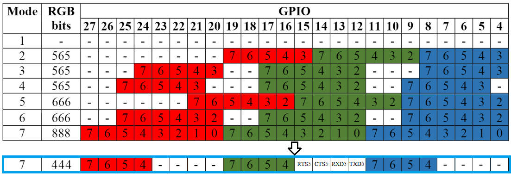

[:fr:](LISEZMOI.md) [:uk:](README.md)

# Pi400VT100
VGA & Serial interface for Raspberry Pi 400

## DPI (Display parallel Interface)
Like [VGA666](https://github.com/fenlogic/vga666), this pcb uses dpi interface (in mode 7, and 3x4bits to free gpio 12 to 15)

see https://www.raspberrypi.org/documentation/hardware/raspberrypi/dpi/README.md

only the necessary bits of the dpi are redirected to the 40-pin GPIO port, with the 'gpio=2-3,8-11,16-19,24-27=a2' line on config.txt

/boot/config.txt
    
    # replace dtoverlay=vc4-kms-v3d with
    dtoverlay=vc4-fkms-v3d
    
    # disable i2c, pin use by h-sync & v-sync
    dtparam=i2c_arm=off
    gpio=2-3,8-11,16-19,24-27=a2
    dpi_output_format=0x17
    enable_dpi_lcd=1
    display_default_lcd=1
    dpi_group=2
    dpi_mode=16
    #---------------- dpi_mode line ---------------------
    #---> 640x480 60hz    dpi_mode=4
    #---> 800x600 60hz    dpi_mode=9
    #---> 1024x768 60hz   dpi_mode=16
    #---> 1280x768 60hz   dpi_mode=23
    #---> 1280x800 60hz   dpi_mode=28
    #---> 1280x960 60hz   dpi_mode=32
    #---> 1280x1024 60hz  dpi_mode=35
    #---> 1360x768 60hz   dpi_mode=39
    #---> 1366x768 60hz   dpi_mode=81
    #---> 1400x1050 60hz  dpi_mode=42
    #---> 1440x900 60hz   dpi_mode=47
    #---> 1600x1200 60hz  dpi_mode=51
    #---> 1680x1050 60hz  dpi_mode=58
    #---> 1920x1080 60hz  dpi_mode=82
    #---> 1920x1200 60hz  dpi_mode=69
    #---> 1920x1440 60hz  dpi_mode=73

## Serial port

    # Enable Uart /dev/ttyAMA1, on pin 12,13,14,15
    dtoverlay=uart5,ctsrts

## Schematic

## PCB

## Installation
copy content of [config-example.txt](img/config-example.txt?raw=true) to /boot/config.txt

install Minicom

    sudo apt update
    sudo apt upgrade
    sudo apt install minicom
    
run minicom with default config

    minicom -D /dev/ttyAMA1

run minicom 9600bps 8bit 

    minicom -b 9600 -8 -D /dev/ttyAMA1

## Révision
rev1
  bad space between VGA and DB9 connectors
  
rev2
  
